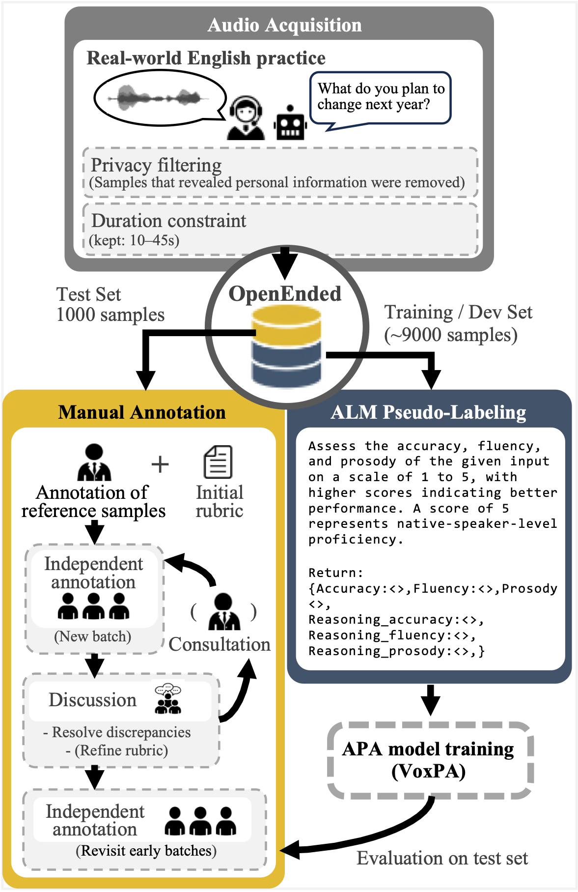
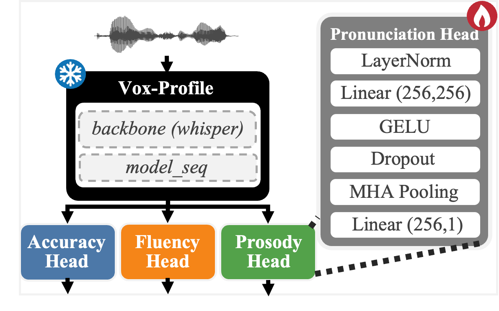

# OpenEnded


This repository accompanies the paper "OpenEnded: An Open-Response Speech Corpus for Pronunciation Assessment with Human Annotations and ALM Supervision" 


## Overview

 


## OpenEnded data download

Download data from [huggingface]


## VoxPA model



### Requirements

```
conda create -n voxpa python=3.8
cd OpenEnded-main
conda activate voxpa
pip install -e .
```

### Download pretrained checkpoint 

Download checkpoint from [huggingface]

### Example
```
python inference_example.py --ckptdir ./checkpoint/voxpa --wavpath /path/to/wavfile.wav
```


## Acknowledgment
- [Vox-Profile](https://github.com/tiantiaf0627/vox-profile-release/tree/main)

## Citation


