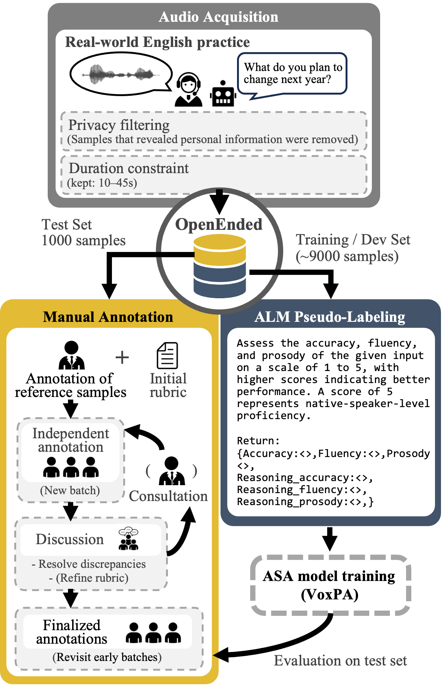
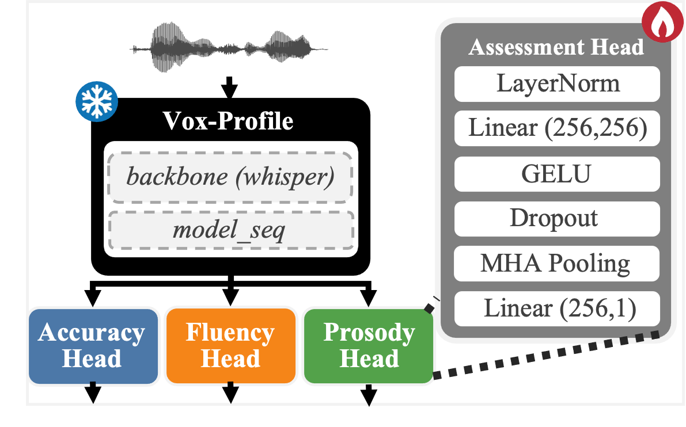

<div align="center">
 
# OpenEnded

</div>

This repository contains the data and resources accompanying our paper,  

**“OpenEnded: An Open-Response Speech Corpus for Speaking Proficiency Assessment with Human Annotations and ALM Supervision**,”  
accepted at SLT 2026 🎊.


## 🗺️ Overview 👀
<table align="center">
  <p align="center">
 
  </p>
</table>

## 📚  OpenEnded data download

Download data from [🤗 huggingface](https://huggingface.co/datasets/yuwchen/OpenEnded)


## VoxPA model

<table align="center">
  <p align="center">

  </p>
</table>

### Requirements

```
conda create -n voxpa python=3.8
cd OpenEnded-main
conda activate voxpa
pip install -e .
```

### Download pretrained checkpoint 

Download VoxPA checkpoint from [🤗 huggingface](https://huggingface.co/datasets/yuwchen/OpenEnded/tree/main/checkpoint)   


### Example
```
python inference_example.py --ckptdir ./checkpoint/voxpa --wavpath /path/to/wavfile.wav
```


## 🙏 Acknowledgment
- [Vox-Profile](https://github.com/tiantiaf0627/vox-profile-release/tree/main)


## 📝  Citation

If you find our paper helpful, please consider citing our papers 📝 and starring us ⭐️！

```bibtex
@inproceedings{chen2026openended,  
title = {OpenEnded: An Open-Response Speech Corpus for Speaking Proficiency Assessment with Human Annotations and ALM Supervision},  
author = {Yu-Wen Chen, Eric Zhou, Evelyn Ding, Tianyi Shen, Zhou Yu, Julia Hirschberg},  
booktitle = {Proc. SLT 2026}  
}  
}
```
